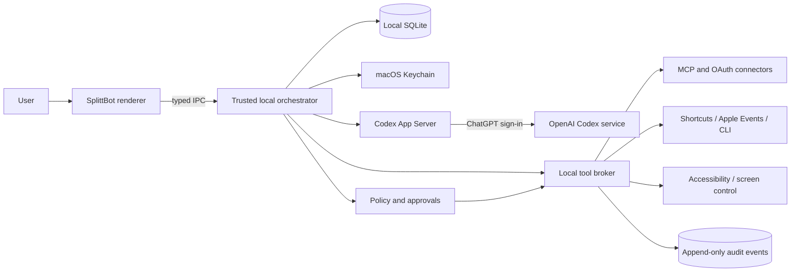

# SplittBot Mac + Codex architecture decision

- Version: 0.3
- Date: August 21, 2026
- Status: Phase 0–3 implemented
- Supersedes: the web/API-first implementation choice in `splittbot-design.md`

## Decision

Build SplittBot as a signed macOS desktop application that runs Codex locally and authenticates through the owner's ChatGPT account.

Use Codex App Server as the agent runtime. The app launches it as a local child process, communicates over JSON-RPC on standard input/output, and uses the documented ChatGPT browser-login flow. Do not require or store an OpenAI API key in v1.

Use a desktop shell because SplittBot needs capabilities a browser cannot safely provide on its own: launching the local Codex runtime, accessing macOS Keychain, reading user-approved files, requesting application permissions, using Shortcuts or Apple Events, showing native notifications, and controlling a local app after explicit approval.

Official references: [Codex App Server](https://developers.openai.com/codex/app-server), [Codex authentication](https://developers.openai.com/codex/auth), and [Codex SDK](https://developers.openai.com/codex/sdk).

## What the attached `codexpath.md` contributes

The attachment is a reference implementation for a hosted CMS assistant. It is not a set of instructions to execute and it should not be copied wholesale.

| Playbook element | SplittBot decision | Reason |
|---|---|---|
| Launch `codex app-server` | Keep | This is the documented interface for rich Codex clients. |
| ChatGPT login | Keep | It satisfies the no-OpenAI-API-key requirement. |
| Bundle/resolve a known Codex runtime | Keep | Avoid dependence on an unknown global installation. |
| Model listing and auth health | Keep | Useful for setup, diagnostics, and plan-aware model selection. |
| Separate writable Codex home | Adapt | Put app data under macOS Application Support and use an OS credential store. |
| File-backed `auth.json` | Do not copy | It was chosen for hosted workers; prefer macOS Keychain/keyring locally. |
| Cosmos auth snapshots and cross-worker callback relay | Remove | A single local app has neither worker switching nor a hosted callback problem. |
| Fresh server for every message | Change | Keep a supervised local App Server process and reconnect/restart it when needed. |
| Ephemeral chat thread | Change | Map each named agent to persistent Codex threads and app-owned memory. |
| `approvalPolicy: never` plus cancelled tools | Change | That makes the reference implementation chat-only. SplittBot needs reviewable tool execution with explicit grants. |
| Dual API-key/Codex modes | Remove from v1 | The product decision is ChatGPT-authenticated Codex only. |
| OpenAI image generation | Exclude from v1 | The attachment itself still requires the API-key path for images. Do not imply that ChatGPT login exposes the Images API. |

## Recommended application stack

### First release

- **Desktop shell:** Electron, signed and notarized for direct macOS distribution.
- **UI:** React + TypeScript using the existing three-pane messenger design.
- **Trusted main process:** TypeScript/Node. It supervises Codex App Server, applies policy, performs tool calls, and owns all persistence.
- **Renderer boundary:** context isolation enabled, no Node access, strict content security policy, and a narrow typed IPC bridge.
- **Local database:** SQLite for agents, tasks, conversations, runs, approvals, memories, schedules, and audit records.
- **Credentials:** macOS Keychain/keyring for Codex and connector secrets; tokens are never sent to the renderer or model context.
- **Files:** `~/Library/Application Support/SplittBot` for app-owned state and explicit security-scoped access to user-selected files/folders.

Electron is recommended for the first build because the Codex runtime and official TypeScript tooling fit naturally in its trusted Node process, while the Grok-style interface can be built quickly in React. A future SwiftUI shell is possible, but it would not change the core App Server, policy, persistence, or tool-broker design.

Do not target the Mac App Store initially. Apple requires App Sandbox for Mac App Store distribution, while outside-store notarization requires hardened runtime and makes App Sandbox optional. SplittBot should use the latter path so its tightly controlled local-agent functions can be evaluated without designing around Store sandbox rules first. Use hardened runtime, Developer ID signing, notarization, and a deliberately small permission surface. Sources: [Preparing an app for distribution](https://developer.apple.com/documentation/xcode/preparing-your-app-for-distribution), [App Sandbox](https://developer.apple.com/documentation/security/app-sandbox), and [notarizing macOS software](https://developer.apple.com/documentation/security/notarizing-macos-software-before-distribution).

## Runtime architecture

### Main-process responsibilities

1. Resolve the bundled Codex executable and app-specific Codex home.
2. Start and monitor `codex app-server --listen stdio://`.
3. Complete App Server initialization and ChatGPT account login.
4. Maintain one application session and persistent threads for named agents.
5. Assemble each turn from agent role, current task, approved memory, and exact tool grants.
6. Route App Server approval requests to durable SplittBot approval cards.
7. Execute only tool calls allowed by the agent's grant and the approved action payload.
8. Record tool input summaries, results, approvals, and failures in the audit log.
9. Restart App Server safely and resume threads after a crash or app update.

### Agent mapping

SplittBot agents are application objects, not separate ChatGPT accounts.

Each agent stores:

- name, role, avatar, job, and success criteria;
- one or more Codex thread identifiers;
- model and reasoning settings available to the signed-in plan;
- skill versions and schedules;
- memory namespace and retention rules;
- connector, folder, command, and application grants;
- approval policy; and
- current tasks, runs, artifacts, and handoffs.

The local orchestrator, not the model, enforces separation. When one agent delegates to another, the receiver gets a separate turn with only its own permissions and a deliberate handoff artifact.

## Local Mac application access

Use the least brittle integration available, in this order:

1. MCP server or provider API with OAuth.
2. Official command-line interface or local service API.
3. Apple Shortcuts or App Intents.
4. Apple Events/AppleScript for a specifically approved target app.
5. Accessibility plus screen capture and input control as a last resort.

The user grants macOS permissions to the SplittBot process, not to an individual AI agent. Therefore SplittBot must add its own stricter per-agent policy. An agent's profile might allow `Calendar.read`, permit Word document creation in one folder, and deny Mail sending even though the operating system has granted SplittBot broader access.

### GUI-control rule

Only one agent may own the local GUI-control lane at a time. Research, connector calls, and file analysis can run concurrently, but two agents must never compete for the keyboard, mouse, focused window, or clipboard.

Every GUI session must provide:

- the visible agent and target app;
- a concise action plan;
- domain/app and action allowlists;
- an approval stop before sending, publishing, purchasing, deleting, changing permissions, or modifying production;
- live pause, takeover, and emergency stop; and
- screenshots or structured evidence sufficient to verify the result.

## Authentication flow

1. On first launch, SplittBot starts App Server and calls its account read method.
2. If signed out, SplittBot requests ChatGPT login and opens the returned authorization URL in the default browser.
3. The local callback completes normally; no pasted callback URL, pending worker ID, or cloud relay is needed.
4. SplittBot waits for the login-completed/account-updated event and then lists available models.
5. Codex credentials use the OS credential store. Connector credentials use separate Keychain records.
6. The account page shows signed-in email/account type, plan where available, model list, and a sign-out action without exposing tokens.

This uses the Codex access associated with the user's ChatGPT plan and is subject to that plan's limits. It does not turn the ChatGPT subscription into a general OpenAI API credential.

## Approval and tool contract

Default policies:

| Action | Default |
|---|---|
| Read user-selected local file | Allowed within agent grant |
| Search/read connected source | Allowed within agent grant |
| Create a new draft or artifact | Allowed in app-owned workspace |
| Modify an existing user file | Ask with before/after preview |
| Run a pre-approved read-only command | Allowed from an exact command template |
| Install software or change system settings | Always ask |
| Send, publish, invite, purchase, delete, or change permissions | Always ask immediately before commit |
| Reveal or transfer credentials | Denied |

For external or destructive actions, implement `prepare` and `commit`. The approval token must bind the agent, target app/service, exact action and arguments, expiration, and idempotency key. A model-generated approval statement is never sufficient.

## Scheduling and background behavior

The app can run scheduled tasks from a login helper while the user is signed in and the Mac is awake. It can display native notifications for results, questions, and approvals.

It cannot reliably work while the Mac is asleep, shut down, or disconnected. A local launch agent does not change that. If true 24/7 execution becomes a requirement, choose one of these later:

- an always-on Mac runner owned by the user;
- an optional cloud worker using separately billed API credentials; or
- a future supported hosted Codex execution product.

The v1 UI must describe missed routines as delayed and run them according to a user-selected catch-up policy after wake/login.

## MVP scope

Include:

1. ChatGPT sign-in and Codex model discovery.
2. Create/edit/archive named agents and assign roles.
3. Direct chat, one group workspace, handoffs, and persistent threads.
4. Local SQLite state, inspectable memory, files, runs, approvals, and audit history.
5. Skill definitions and awake-only scheduled routines.
6. MCP connector catalog and per-agent grants.
7. One structured local-app adapter, preferably Shortcuts.
8. One opt-in Accessibility automation proof of concept with serialized GUI control.
9. Pause, takeover, emergency stop, and result verification.

Exclude:

- OpenAI API keys and usage billing;
- cloud execution or multi-user SaaS;
- image generation through the OpenAI Images API;
- arbitrary third-party plugin code;
- silent background screen control;
- autonomous sending, publishing, purchasing, deletion, permissions, or production changes; and
- mobile clients.

## Build sequence

### Phase 0 — feasibility spike

- Launch bundled Codex App Server from a minimal signed app.
- Complete ChatGPT login and list models.
- Start/resume one persistent thread and stream events.
- Close/reopen the app and prove account/thread recovery.
- Verify how Codex plan limits and errors appear in the client.

### Phase 1 — agent desktop

- Implement the messenger UI, agent profiles, local database, thread mapping, runs, and artifacts.
- Add typed IPC, renderer hardening, structured logs, and secret redaction.
- Build the approval inbox, per-agent grants, and immutable audit events.

### Phase 2 — tools and routines

- **Implemented:** MCP/OAuth connector discovery/configuration with per-agent grants for user-configured MCP services.
- **Implemented:** reviewed skill catalog with explicit typed `$skill` invocation.
- **Implemented:** awake-only daily/interval scheduling, wake catch-up rules, persisted retries/recovery, and native/local notifications.
- **Implemented:** approval-gated structured Apple Shortcuts adapter with private temporary input/output and artifact capture.

### Phase 3 — controlled GUI automation

- **Implemented:** opt-in Accessibility and Screen Recording permission checks with direct System Settings links.
- **Implemented:** one persistent serialized GUI lane, exact plan approval, live evidence, pause/resume, takeover, safe retries, and a latched emergency stop.
- **Implemented:** adversarial coverage for prompt injection as literal data, focus changes, modal dialogs, retries, lane bypass attempts, and emergency stop.

## Acceptance test for the first vertical slice

Create a **Chief of Staff** agent that:

1. signs in through the owner's ChatGPT account;
2. reads an approved calendar and a selected local project folder;
3. produces a source-linked morning brief as a local artifact;
4. asks before opening or changing another app;
5. can create a draft through one approved Shortcut but cannot send it;
6. remembers formatting preferences without retaining credentials; and
7. records enough evidence to show exactly what it read and changed.

The prototype is successful only after the app restarts cleanly, resumes the agent thread, obeys a denied permission, pauses before a consequential action, and reports a missed scheduled run accurately after the Mac wakes.
