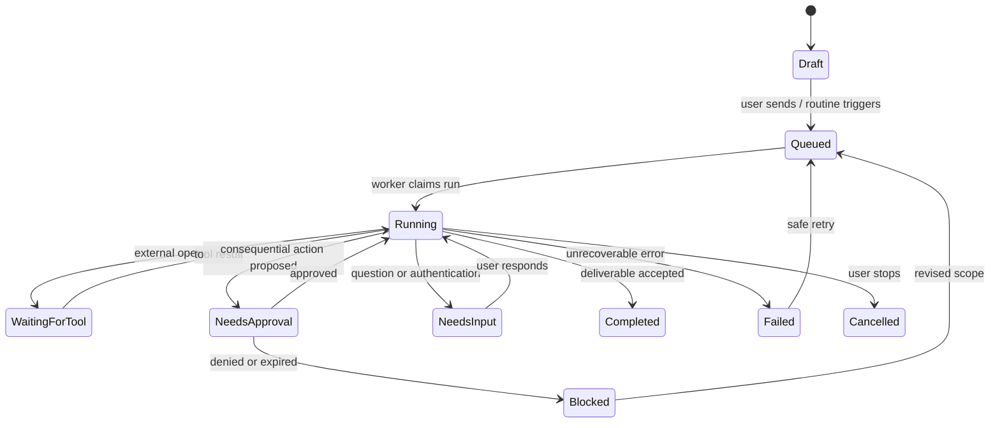
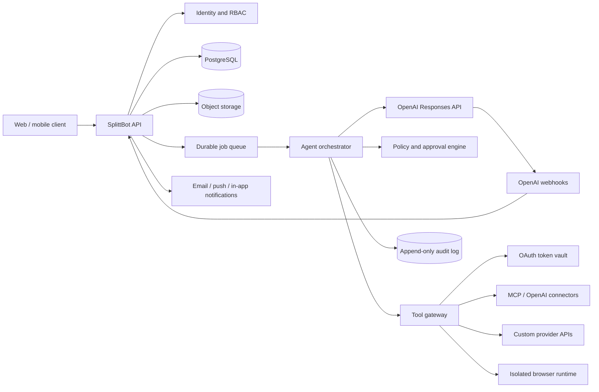

# SplittBot product and architecture design

- Version: 0.2
- Date: August 21, 2026
- Status: product and UX design; implementation architecture revised

> **Architecture update:** The product model and interface in this document remain current. The original web/OpenAI-API-first implementation has been superseded for v1 by the [Mac + Codex architecture decision](mac-codex-architecture.md). Sections describing the cloud/API design are retained as a possible future SaaS path, not the initial build.

## 1. Product decision

Build SplittBot first as a desktop-first macOS application powered by local Codex App Server and authenticated through the owner's ChatGPT account. Local-computer control is now a core requirement, so the native host is part of the initial architecture rather than a later packaging step.

Preserve the responsive product design so a cloud or mobile companion can be added later, but do not require an OpenAI API project or API key for v1.

### Why the Mac app is the primary path

- We control the Grok-style roster, group chat, approval inbox, run inspector, connector catalog, and audit experience.
- It can launch Codex App Server and use the documented ChatGPT login flow.
- It can access Keychain, selected files, Shortcuts, Apple Events, and explicitly approved Accessibility automation.
- It can enforce per-agent connector, folder, command, and application grants locally.
- It provides a complete run, approval, and audit experience without placing credentials in a browser.
- It preserves our own Grok-style roster and collaboration interface.

### ChatGPT account reality

There are three relevant OpenAI product surfaces:

1. **Codex App Server.** OpenAI documents this as the interface for embedding Codex into rich clients, including authentication, conversation history, approvals, and streamed agent events. It supports ChatGPT sign-in. This is the v1 runtime. Sources: [App Server](https://developers.openai.com/codex/app-server) and [Codex authentication](https://developers.openai.com/codex/auth).
2. **ChatGPT workspace agents.** Shared workspace agents remain a possible future edition, subject to workspace availability and product limitations.
3. **OpenAI API.** A future cloud/SaaS deployment could use a server-side OpenAI API project and separately metered API usage, but this is explicitly outside v1.

For v1, “use my ChatGPT account” means the local SplittBot app starts Codex App Server and completes its documented ChatGPT browser-login flow. It does not place a personal API key in the renderer, and it does not imply access to unrelated OpenAI APIs such as image generation.

### Capability mapping

| Grok Bot capability | OpenAI building block | What SplittBot must add |
|---|---|---|
| Named persistent Bots | Model instructions and Responses conversations | Agent profiles, role ownership, memory, status, lifecycle |
| Background work | Responses background mode and webhooks | Durable queue, resumable runs, retry/cancel, notifications |
| Multi-Bot collaboration | Responses multi-agent beta and Agents SDK patterns | Persistent agent roster, per-agent scopes, handoff event bus |
| Connectors/plugins | OpenAI connectors, remote MCP, function tools | OAuth UI, token vault, catalog, agent grants, policy gateway |
| Cloud computer | OpenAI computer tool | Isolated browser/container runtime, live view, takeover, recovery |
| Skills and routines | Tool/skill patterns and workspace-agent schedules | Versioned skill store, scheduler, event filters, run history |
| Approval cards | MCP approval requests | Cross-tool risk engine, prepare/commit protocol, approval inbox |
| Files and artifacts | File inputs, file search, model-generated outputs | Object storage, previews, access control, evidence lineage |
| Usage display | API usage metadata and pricing | Per-run ledger, estimates, budgets, caps, admin reports |
| Team governance | OpenAI project/workspace controls | SplittBot RBAC, connector policy, retention, complete audit log |

## 2. Product vision

SplittBot gives one person a small, trustworthy AI team. Each agent owns a repeatable outcome, works only with approved sources and actions, builds useful context over time, and returns when a decision is needed.

The product promise:

> Name the teammate, define the job, connect the right tools, and hand off the outcome.

The product should feel like a team messenger, not an automation builder. Formal workflows emerge from successful conversations rather than being mandatory before the first useful task.

## 3. Design principles

1. **Outcome before workflow.** Ask what should be finished, not for a click-by-click script.
2. **One agent, one owned job.** Split roles when tools, approval boundaries, schedules, or success criteria differ.
3. **Connector first, browser second.** Structured APIs are more reliable, auditable, and permissionable.
4. **Prepare before acting.** Default to research, reconcile, recommend, and draft.
5. **Propose, inspect, commit.** Consequential work is a two-phase transaction.
6. **Memory is not truth.** Changing facts must be reopened from authoritative sources.
7. **Collaboration without shared secrets.** Agents share selected artifacts and messages, not credential stores.
8. **Every run is observable.** The user can see owner, plan, tools, evidence, cost, state, outputs, and pending decisions.
9. **Safe retries.** Tool writes use idempotency keys and can resume without duplicating external actions.
10. **Original product identity.** Recreate the interaction pattern, not Grok's branding, copy, or visual trade dress.

## 4. Core product objects

### Agent

A durable AI teammate with:

- name, title, avatar, color, and status;
- one primary job and measurable outcome;
- durable instructions and working style;
- model policy and reasoning profile;
- owned connector/tool grants;
- enabled skills;
- memory namespace and retention policy;
- approval policy;
- schedules/event triggers; and
- one or more conversations.

### Conversation

A direct or group thread containing user messages, agent messages, handoffs, tool activity, artifacts, questions, and approval cards.

### Task

The user-visible unit of work: objective, sources, constraints, deliverable, review point, owner, priority, deadline, and status.

### Run

One execution attempt for a task or routine. A run has a plan, checkpoints, model calls, tool calls, artifacts, cost, timing, errors, and audit events.

### Skill

A versioned reusable procedure that defines when it applies, required inputs, source systems, ordered work, decisions, validation, output, failure behavior, and approval boundaries.

### Routine

A schedule or event rule that starts a skill/task for one owning agent with explicit input, time zone, stale-data policy, retry policy, and output destination.

### Connector

An authenticated integration. The connector stores provider metadata and token references; each agent receives a separate grant containing allowed tools, resources, and action classes.

### Approval

A durable request to authorize one exact action. It includes the target, proposed values, before/after preview, risk class, expiration, idempotency key, and approving user.

### Artifact

A source or result: file, document, spreadsheet, image, link, screenshot, export, report, or structured data set. Artifacts can be shared with named agents without sharing credentials.

## 5. Information architecture

```text
SplittBot
├── Home
│   ├── Needs attention
│   ├── Working now
│   ├── Recent results
│   └── Upcoming routines
├── Agents
│   ├── Direct conversations
│   ├── Sections / projects
│   └── Agent profiles
├── Groups
│   └── Shared conversations and handoffs
├── Runs
│   ├── Active
│   ├── Completed
│   └── Failed / cancelled
├── Approvals
│   ├── Waiting
│   └── Decision history
├── Automations
│   ├── Skills
│   ├── Routines
│   └── Event triggers
├── Connectors
│   ├── Catalog
│   ├── Installed
│   └── Agent grants
├── Files
│   └── Shared artifacts by project
└── Settings
    ├── Models and budget
    ├── Notification rules
    ├── Security policy
    ├── Audit log
    └── Team administration
```

## 6. Primary desktop layout

Use a three-pane messenger layout.

```text
┌──────────────────┬───────────────────────────┬───────────────────────────────┐
│ Navigation       │ Team / conversation list  │ Active conversation           │
│                  │                           │                               │
│ Home             │ Needs attention (3)       │ Maya · Account Research       │
│ Agents            │ ● Maya       waiting      │ Working on Q3 prospect list…  │
│ Groups            │ ● Felix      working      │                               │
│ Runs              │ ● Quinn      result       │ [Plan] [Tool activity]        │
│ Approvals  3      │                           │ [Evidence] [Draft artifact]   │
│ Automations       │ Growth Team               │                               │
│ Connectors        │  # Launch room            │ Maya → Quinn: review scores   │
│ Files             │                           │                               │
│                  │ Recent                    │ ┌───────────────────────────┐ │
│ Settings          │  Weekly risk report       │ │ Ask Maya…       Attach @ /│ │
└──────────────────┴───────────────────────────┴───────────────────────────────┘
```

An optional inspector opens from the right for profile, connected tools, memory, routines, files, and current run details. Avoid a permanently visible fourth pane.

## 7. Key screens

### Home / command center

Show only operationally useful information:

- approvals and questions waiting for the user;
- agents currently working;
- failed or overdue routines;
- newly completed deliverables;
- next scheduled runs; and
- daily/weekly budget progress.

### Create an agent

Use a conversational wizard with a structured review screen.

1. **Identity:** name, title, avatar, color.
2. **Job:** owned outcome and success criteria.
3. **Sources:** connectors, projects, files, websites.
4. **Working style:** evidence, format, tone, frequency.
5. **Boundaries:** allowed actions and actions requiring approval.
6. **Memory:** what may be remembered and for how long.
7. **First task:** run a safe read-only test.

Example profile:

```yaml
name: Maya
title: Account Researcher
job: Produce evidence-linked account briefs for approved prospect lists.
success:
  - Every factual claim has a source.
  - Existing active opportunities are excluded.
  - Final output is a review list, never sent outreach.
tools:
  - salesforce.read
  - google_drive.read:/Sales/ICP
  - web.search
approvals:
  - always: [email.send, crm.write, linkedin.action]
memory:
  retain: [report_format, scoring_preferences]
  never_retain: [credentials, one_time_codes]
```

### Agent conversation

The transcript should render distinct cards for:

- plan/checklist;
- status/progress;
- agent-to-agent handoff;
- tool call with input and result summary;
- source/evidence;
- artifact preview;
- question/blocker;
- approval proposal; and
- completion summary.

The composer supports attachments, `@agent`, `@connector`, `/skill`, task priority, deadline, and “run in test mode.” A direct user message can steer the active run; Stop cancels future work but clearly states that completed external actions are not undone.

### Group workspace

Show one explicit owner for the current stage. Handoffs are first-class timeline events:

```text
Maya (Research) ──brief──▶ Quinn (Review) ──approved draft──▶ Felix (Operations)
```

Default group behavior should be conservative: only mentioned agents or the current owner act. An “auto-coordinate” toggle can allow the coordinator to delegate.

### Approval inbox

Every card answers:

- Who requested this?
- What exact action will occur?
- Which account/resource is targeted?
- What data will be sent or changed?
- What is the current value and proposed value?
- Is it reversible?
- What evidence supports it?
- What will happen after approval?

Actions: Approve once, Edit and approve, Deny, Ask a question. “Always allow” belongs in a separate policy editor and must never be a casual button for high-risk classes.

### Run inspector

Include timeline, plan, model/tool activity, artifacts, evidence, token/tool cost, elapsed time, retries, approvals, errors, and a redacted raw event view. The inspector is the basis for support and audit—not a later add-on.

### Connectors catalog

Each connector card shows:

- provider and verification status;
- read/write capabilities;
- OAuth scopes before connection;
- agents currently granted access;
- last use and recent failures;
- per-tool enable/disable controls; and
- disconnect/revoke controls.

### Skills and routines

Skills use a versioned readable document plus structured policy fields. Routines show owner, trigger, time zone, next run, last result, failure policy, budget ceiling, and active/paused state. A Test button must make clear that testing can perform real reads/writes unless “simulation only” is selected.

## 8. Task and run state model



Never overload “done.” Track at least:

- analysis completed;
- draft prepared;
- approval granted;
- external action executed;
- external state verified; and
- user notified.

## 9. Approval and risk model

| Action class | Default | Examples |
|---|---|---|
| Read public | Allow | Web search, public page |
| Read connected | Allow if granted | Email search, CRM lookup |
| Compute/draft | Allow | Analyze, summarize, create draft |
| Write reversible internal | Ask once or policy | Create draft record, update a non-production document |
| Communicate externally | Always ask | Send email, post message, invite user |
| Publish | Always ask | Social post, public website change |
| Financial/legal | Always ask + re-auth | Purchase, transfer, accept terms |
| Permissions/security | Always ask + admin | Add member, create token, change access |
| Destructive | Always ask + typed confirmation | Delete, overwrite, cancel |
| Production | Always ask + environment check | Deploy, modify production data/settings |

Every write tool implements a `prepare` operation and a `commit` operation. The model can call `prepare` freely within its grant; `commit` requires a signed approval token bound to the user, exact arguments, action hash, expiration, and idempotency key.

## 10. Future cloud/SaaS technical architecture (not v1)

This section records the original OpenAI API design for a possible future hosted edition. It is not the approved architecture for the Mac v1.



### Suggested stack

- **Client:** TypeScript, React, Next.js, accessible component library, responsive PWA.
- **API:** TypeScript service with schema validation and generated OpenAPI contracts.
- **Database:** PostgreSQL with row-level tenant boundaries and `pgvector` only where semantic retrieval is needed.
- **Queue/workflows:** a durable workflow engine or managed queue with retries, leases, heartbeats, and cron/event scheduling.
- **Files:** encrypted object storage with malware scanning, MIME validation, and signed URLs.
- **Secrets:** cloud KMS plus a dedicated encrypted OAuth-token vault.
- **Observability:** OpenTelemetry traces, structured logs, per-run cost metrics, and redaction at ingestion.
- **Browser runtime:** isolated ephemeral containers with durable encrypted browser profiles per agent only when explicitly enabled.

Avoid a single monolithic server request for long work. The app must survive client disconnects, deploys, and worker restarts.

## 11. Future OpenAI API implementation mapping (not v1)

### Responses API

Use the Responses API as the primary model interface. A run creates or continues agent context, streams visible events, calls tools, and produces structured completion output. Background mode supports asynchronous long-running model work, and webhooks notify the backend when responses complete. Sources: [background mode](https://developers.openai.com/api/docs/guides/background) and [webhooks](https://developers.openai.com/api/docs/guides/webhooks).

### Persistent named agents

Named agents are an application-level construct. Store profile, instructions, memory, tool grants, conversation IDs, and summaries in SplittBot. Do not assume one model conversation is the full durable identity.

Recommended context assembly for each turn:

1. global safety and tenant policy;
2. agent job and durable boundaries;
3. current task and acceptance criteria;
4. scoped tool definitions;
5. relevant verified memories with dates/sources;
6. recent conversation summary and unresolved state; and
7. the new user or agent message.

### Multi-agent behavior

OpenAI's beta Responses multi-agent capability can spawn parallel subagents and coordinate them inside one request. It is useful for bounded, same-permission research. The official documentation says all subagents in the tree receive the request's available tools. Source: [Responses multi-agent](https://developers.openai.com/api/docs/guides/responses-multi-agent).

SplittBot needs per-agent security scopes, so its durable named-agent collaboration should run at the application layer:

- the coordinator creates a handoff record;
- the receiving agent gets a separate run with only its granted tools;
- its result returns as a signed message/artifact reference; and
- the coordinator resumes with the result.

Use native Responses multi-agent only when all participating subagents may safely share the same tools and data boundary.

### Connectors and MCP

OpenAI currently documents built-in API connectors for Dropbox, Gmail, Google Calendar, Google Drive, Microsoft Teams, Outlook Calendar, Outlook Email, and SharePoint. GitHub can use its official remote MCP server. The client application must perform OAuth and pass connector authorization. MCP calls support approval requests. Source: [MCP and connectors](https://developers.openai.com/api/docs/guides/tools-connectors-mcp).

Implement all connector calls through the SplittBot tool gateway so the model never receives refresh tokens. The gateway exchanges or retrieves access tokens, validates the agent grant, redacts logs, enforces read/write policy, applies idempotency, and returns the smallest necessary result.

### Computer use

OpenAI's computer tool can inspect screenshots and return UI actions for our harness to execute. OpenAI recommends isolated browsers/containers, domain/action allowlists, and human review for purchases, authenticated flows, destructive actions, or hard-to-reverse work. Source: [computer use](https://developers.openai.com/api/docs/guides/tools-computer-use).

Computer use is Phase 2, not MVP. When added:

- each agent gets its own browser profile and cookie jar;
- no agent can see another agent's browser session;
- network egress uses a domain allowlist;
- downloads are scanned and quarantined;
- credentials use takeover or a secrets broker;
- screenshots are retained for a short configurable period;
- action batches are interrupted before risky steps; and
- the user sees live view, pause, takeover, and emergency stop.

## 12. Data model

Core tables/collections:

```text
users
organizations
memberships
agents
agent_profiles
agent_memories
agent_tool_grants
conversations
conversation_members
messages
tasks
runs
run_steps
handoffs
artifacts
skills
skill_versions
routines
routine_runs
connectors
connector_accounts
oauth_token_refs
approvals
approval_decisions
tool_calls
audit_events
notifications
usage_ledger
```

Important boundaries:

- `organization_id` on every tenant-owned record;
- separate `agent_id` grants for every connector/tool;
- token material stored outside the main database;
- immutable audit events with redacted payloads and cryptographic hashes;
- memory records with source, confidence, observed date, expiry, and sensitivity;
- artifacts shared through explicit access-control rows; and
- deletion jobs that revoke tokens, pause routines, delete browser profiles, and track retention obligations.

## 13. Memory design

Memory categories:

| Type | Example | Policy |
|---|---|---|
| Preference | “Use five bullets and source links” | Durable, editable |
| Role rule | “Never contact customers” | Durable, high priority |
| Workflow knowledge | Validated sequence and failure handling | Versioned skill |
| Entity context | Account owner prefers annual terms | Source-linked, expiring |
| Run state | Waiting for approval on draft 12 | Task-bound |
| Secret | Password, token, one-time code | Never stored as memory |

The agent should say when it is relying on memory. Consequential decisions require reopening the source. Users can inspect, correct, pin, expire, or delete memories.

## 14. Plugin system

Treat “plugin” as a signed package that may declare:

- one or more MCP servers or provider adapters;
- skills and prompt assets;
- connector OAuth metadata;
- optional UI cards/forms;
- event triggers;
- tool risk classifications; and
- minimum SplittBot version.

Example manifest:

```json
{
  "id": "com.splittbot.salesforce",
  "version": "1.2.0",
  "publisher": "SplittBot",
  "capabilities": ["connector", "skills"],
  "tools": [
    { "name": "salesforce.query", "risk": "read_connected" },
    { "name": "salesforce.update", "risk": "write_reversible" }
  ],
  "oauth": {
    "provider": "salesforce",
    "scopes": ["api", "refresh_token"]
  }
}
```

MVP supports only reviewed first-party packages and remote MCP servers on an allowlist. Do not execute arbitrary marketplace code in the main application process. Later marketplace releases should use pinned versions, signature verification, automated scanning, manual review, permission diffs on update, and rapid revocation.

## 15. Scheduling and event triggers

Each routine stores:

- owner agent;
- skill/version;
- cron/calendar schedule or event filter;
- time zone;
- maximum duration and cost;
- input source and freshness requirements;
- retry/backoff and idempotency policy;
- approval policy;
- output destination; and
- behavior when data is missing or stale.

Event listeners must be narrow. “Every new message” is disallowed by default; prefer filters such as channel + phrase + link type + sender group.

## 16. Cost controls

Cost visibility is a product feature, not just an admin report.

- Estimate a run range before expensive work.
- Show model tokens, hosted-tool calls, connector calls, browser minutes, and storage.
- Set per-run, per-agent, daily, and monthly limits.
- Pause routines before crossing a hard cap.
- Prefer smaller models for classification/routing and frontier models for complex synthesis.
- Cache stable prefixes and compact long histories.
- Use native multi-agent only when parallelism is worth the additional tokens.

## 17. Security requirements

Release-blocking requirements:

- OAuth tokens encrypted and never exposed to client or model context.
- Per-agent tool grants enforced server-side.
- No cross-tenant retrieval under adversarial tests.
- Approval tokens bound to exact action hashes and short expirations.
- Idempotency on all external writes.
- Prompt-injection handling for web, email, and document content.
- Tool outputs labelled as untrusted data, not instructions.
- Domain/action allowlists for browser work.
- Append-only action audit log.
- Emergency stop that prevents new actions and cancels queued work.
- Connector revoke and full agent offboarding flow.
- File malware scanning and content-type validation.
- Structured secret redaction before logs/traces.

## 18. Historical cloud/API MVP scope (superseded)

For the approved v1 scope, use the [Mac + Codex architecture decision](mac-codex-architecture.md#mvp-scope). The scope below is retained only for evaluating a future hosted edition.

### Include

- Single-user accounts with team-ready tenant model.
- Create/edit/archive named agents.
- Direct chat and one group workspace.
- Persistent agent profile and inspectable memory.
- Background runs, streaming progress, cancel/retry.
- Attachments and generated artifacts.
- OpenAI web search/file analysis.
- Gmail, Google Calendar, Google Drive, Outlook Email/Calendar, Teams, and SharePoint.
- Skills from successful tasks.
- Scheduled routines.
- Approval inbox, prepare/commit writes, and audit log.
- In-app and email notifications.
- Per-run usage/cost display.

### Exclude from MVP

- Arbitrary marketplace code.
- Browser/computer use on third-party websites.
- Teach-by-demonstration.
- Local computer control.
- Mobile native apps.
- Autonomous purchasing, publishing, deletion, permissions, or production changes.
- Unreviewed agent self-creation.

## 19. Historical cloud/API delivery plan (superseded)

For the approved build sequence, use the [Mac + Codex architecture decision](mac-codex-architecture.md#build-sequence).

### Phase 0 — account and prototype decision (2–3 days)

- Confirm whether the intended owner has personal ChatGPT or Business/Enterprise/Edu workspace access.
- Create an OpenAI API project and non-production budget if building standalone.
- Prototype one agent chat, one connector read, one background run, and one approval card.
- Validate costs and latency with ten representative tasks.

### Phase 1 — trustworthy single-agent MVP (3–5 weeks)

- Auth, tenant boundary, agent profiles, conversations, tasks, runs.
- Responses API integration, streaming, background work, webhooks.
- Files/artifacts, memory, Gmail/Calendar/Drive.
- Approval engine, audit log, cost ledger.
- Scheduled routines and notifications.

### Phase 2 — small-team collaboration (2–4 weeks)

- Group workspaces, handoffs, current-stage owner.
- Outlook, Teams, SharePoint, GitHub/MCP.
- Skill versioning, event triggers, team roles, connector grants.
- Evaluation suite and reliability dashboard.

### Phase 3 — browser/computer work (4–8 weeks)

- Per-agent isolated browser profiles.
- Computer-use harness, live view, pause/takeover, domain controls.
- CAPTCHA/2FA/secret handoff.
- Download quarantine, screenshot policy, failure recovery.
- Teach-by-demonstration as a draft-skill generator.

### Phase 4 — marketplace and native clients

- Reviewed plugin marketplace.
- Desktop shell if local-computer control is justified.
- Mobile approval/review app.
- Enterprise SSO, SCIM, retention policies, exportable audit events.

## 20. Evaluation plan

Build a fixed test set for each role. Grade:

- task completion;
- source correctness and citation coverage;
- tool selection;
- permission compliance;
- approval-stop accuracy;
- duplicate-write prevention;
- stale-data handling;
- handoff completeness;
- artifact quality;
- recovery from connector/browser failures;
- cost; and
- time to useful result.

No routine is enabled until it succeeds twice on representative inputs, handles one missing-source case, respects all approval boundaries, and passes an idempotent retry test.

## 21. Initial agent templates

Ship a small high-quality set:

1. **Chief of Staff** — source-linked daily digest and decisions needed.
2. **Account Researcher** — evidence-linked account briefs; no outreach.
3. **Content Planner** — briefs and drafts; publishing always requires approval.
4. **Expense Reviewer** — reconciliation and policy exceptions; no reimbursements.
5. **Bug Reproducer** — staging-only repro packs with screenshots and logs.
6. **Meeting Prep** — calendar-driven briefs from approved sources.

Each template should be useful in read-and-prepare mode before any write access is granted.

## 22. Historical cloud-path open decisions

Before implementation, answer these product questions:

1. Is SplittBot initially a personal single-user app or a multi-company SaaS product?
2. Does the owner have ChatGPT Business/Enterprise/Edu workspace-agent access, or only a personal plan?
3. Which first two connectors produce the highest-value daily workflow?
4. Is browser control required for the first useful workflow, or can it wait for Phase 3?
5. Which actions, if any, may execute without approval?
6. What monthly API/tool budget should the MVP enforce?
7. Which first agent role will be the acceptance-test scenario?

## 23. Product acceptance scenario

Start with a narrow vertical prototype: one **Chief of Staff** agent that reads an approved calendar and selected local project folder, produces a source-linked daily brief, and stops at drafts. The definitive technical acceptance test is in the [Mac + Codex architecture decision](mac-codex-architecture.md#acceptance-test-for-the-first-vertical-slice).
